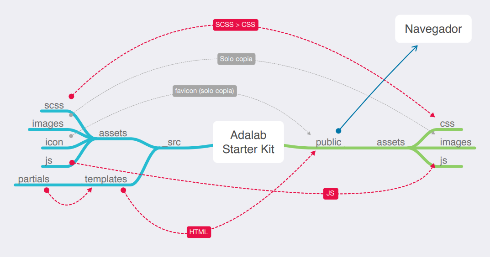

# Adalab web starter kit

Ahoy! Esta es nuestro Starter Kit en node/gulp para este primer contacto con el desarrollo web
Incluye SCSS, un sistema de plantillas HTML y un web server.

## Guía de inicio rápido

Necesitarás instalar [Node.js](https://nodejs.org/) y [Gulp](https://gulpjs.com) para trabajar con este Starter Kit, luego:

1. Descarga o clona el repositorio
2. Instala las dependencias locales con `npm install`
3. Arranca el kit con `gulp`

## Espera, ¿esto se hace siempre?

> ### Solo una vez al principio en cada ordenador que utilicemos:

- Instalamos node
- Instalamos el comando de gulp de forma global para poder usarlo desde cualquier carpeta usando `npm install --global gulp-cli`

> ### Cada vez que descarguemos o clonemos un repo:

- `npm install` para instalar los paquetes necesarios para convertir Sass a CSS, minizarlo, etc.

> ### Cada vez que estemos trabajando con nuestro código:

- Desde nuestra terminal, ejecutamos el comando `gulp` para que realice la tarea por defecto, que en el caso del `gulpfile.js` que tenemos en adalab-web-starter-kit estará pendiente de nuestros archivos Sass, html y JavaScript y los compilará, minificará y/o recargará el servidor cada vez que hagamos un cambio

## Tareas de gulp incluidas

### Inicio de un web server para desarrollo

```
npm start
```

o lo que en este proyecto es lo mismo:

```
gulp
```

Lanza un webserver con BrowserSync y varios watchers estarán pendientes de los archivos SCSS/JS/HTML, en la carpeta **public/**, para recargar el navegador cuando se necesite.

### Versión lista para subir a producción

Para generar los ficheros para producción ejecuta:

```
npm run docs
```

o lo que en este proyecto es lo mismo:

```
gulp docs
```

En la carpeta **docs/** se generarán los CSS y JS minimizados y sin sourcemaps listos para subir al repo. A continuación súbelos al repo y activa en GitHub Pages la opción **master/docs/**, para que GitHub Pages sirva la página desde la carpeta **docs/**.

---

Si quieres generar los ficheros listos para producción y además subirlos a GitHub directamente ejecuta el siguiente comando:

```
npm run push-docs
```

Este comando borra la carpeta **docs/**, la vuelve a generar, crea un commit con los nuevos ficheros y hace un `git push`, todo del tirón. ¿Cómo se te queda el cuerpo?. Si quieres saber cómo funciona échale un ojo al fichero `package.json`.

## Flujo de archivos con gulp

Estas tareas de gulp producen el siguiente flujo de archivos:



## Estructura del proyecto

Nuestro **gulpfile.js** usa un JSON de configuración con las rutas de los archivos a generar/vigilar.

La estructura de carpetas tiene esta pinta:

```
/
`- _src
   |- api
   |  |- data.json // para crearnos un servidor de datos local
   |- assets
   |  |- icons
   |  |- images
   |  |- js
   |  `- scss
   |     `- core
   |
   `- templates
      `- partials

```

## HTML

Viene incluído el paquete [**gulp-html-partial**](https://www.npmjs.com/package/gulp-html-partial) que nos va a permitir tener un sistema de plantillas html

## Imágenes e iconos

Tenemos en **\_src/** una carpeta para las imágenes del proyecto y una para los iconos como el favicon o los iconos de dispositivos móviles. Estos últimos se generan en la raíz de las carpetas **public/** y **docs/**

## CSS

Viene incluído el paquete [**gulp-combine-mq**](https://www.npmjs.com/package/gulp-combine-mq) que agrupa todas las mediaqueries al final del documento css.

## JS

Podemos usar parciales de JS: en el JSON de configuración, **config.json** especificamos los archivos JS que utilizamos y en el orden que deben procesarse.

## ¿Cómo actualizo si tengo una versión anterior?

En principio puedes descargar todos los archivos fuera de **\_src/** y sustituir los de tu proyecto. Además deberías replicar la estructura de carpetas dentro de **\_src/**.

## Falta algo?

Echas de menos que el kit haga algo en concreto? Pidelo sin problema a través de los Issues o si te animas a mejorarlo mándanos un PR :)
